# Q1 Affine Rectification

## Books

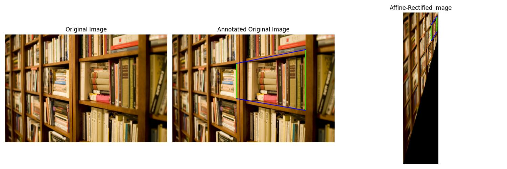</img>

Cosines before and after affine rectification:

<table border="1">
    <tr><td>0.9999</td><td>1.0</td></tr>
    <tr><td>0.9334</td><td>1.0</td></tr>
</table>

## Tiles 5

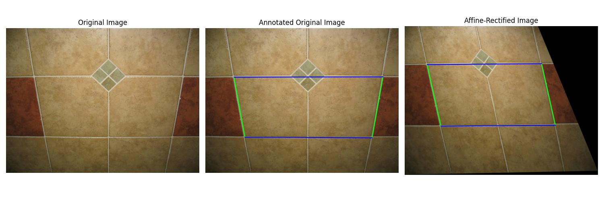</img>

Cosines before and after affine rectification:

<table border="1">
    <tr><td>0.9375</td><td>1.0</td></tr>
    <tr><td>1.0</td><td>1.0</td></tr>
</table>

## Chess

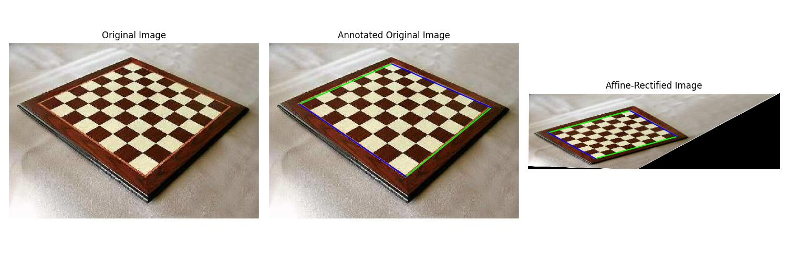</img>

Cosines before and after affine rectification:

<table border="1">
    <tr><td>0.9634</td><td>1.0</td></tr>
    <tr><td>-0.983</td><td>-1.0</td></tr>
</table>

## Painting

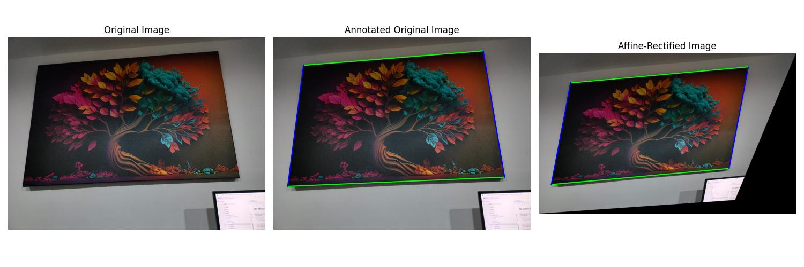</img>

Cosines before and after affine rectification:

<table border="1">
    <tr><td>0.9993</td><td>1.0</td></tr>
    <tr><td>0.9563</td><td>1.0</td></tr>
</table>

## Ceiling

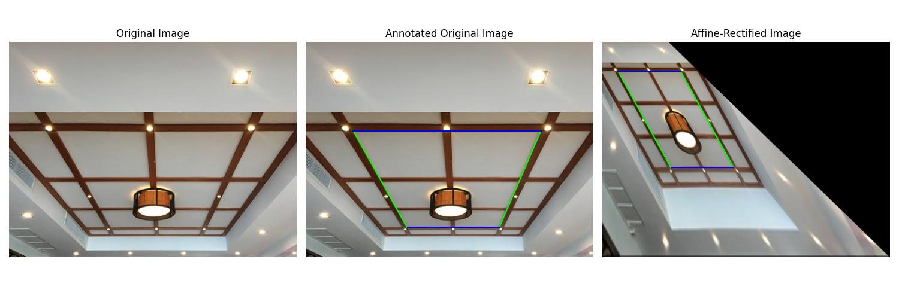</img>

Cosines before and after affine rectification:

<table border="1">
    <tr><td>-0.6111</td><td>1.0</td></tr>
    <tr><td>1.0</td><td>-1.0</td></tr>
</table>

# Q2. Metric Rectification

## Books

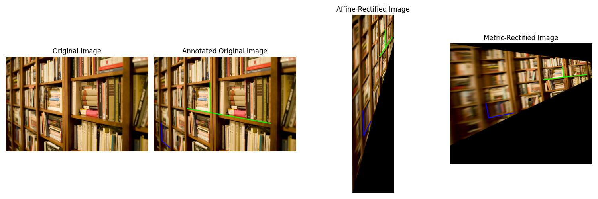</img>

Cosines before and after affine rectification:

<table border="1">
    <tr><td>-1.8494e-01</td><td>1.5559e-17</td></tr>
    <tr><td>-6.9356e-01</td><td>1.0396e-15</td></tr>
</table>

## Tiles 5

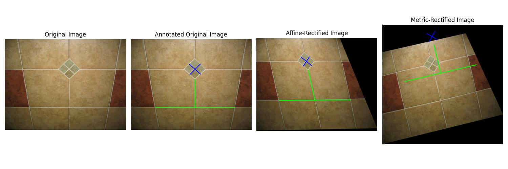</img>

Cosines before and after affine rectification:

<table border="1">
    <tr><td>-4.7505e-03</td><td>-4.6238e-16</td></tr>
    <tr><td>-6.2938e-02</td><td>-2.2238e-16</td></tr>
</table>

## Chess

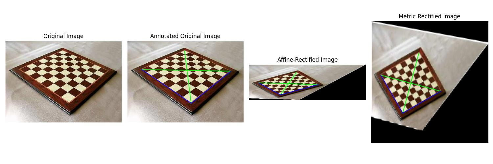</img>

Cosines before and after affine rectification:

<table border="1">
    <tr><td>-1.4302e-01</td><td>6.1098e-16</td></tr>
    <tr><td>2.8502e-01</td><td>-6.0925e-16</td></tr>
</table>

## Painting

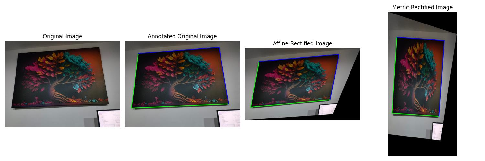</img>

Cosines before and after affine rectification:

<table border="1">
    <tr><td>1.6696e-01</td><td>3.1194e-16</td></tr>
    <tr><td>-8.6989e-02</td><td>3.7487e-16</td></tr>
</table>

## Ceiling

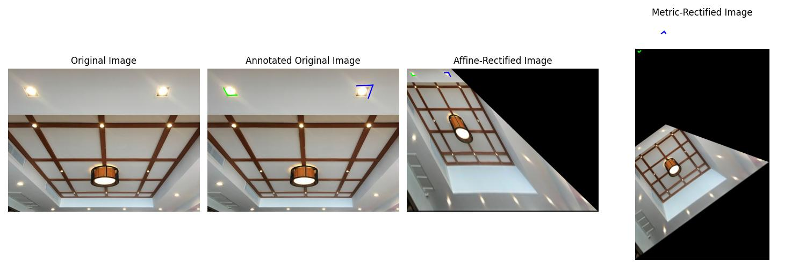</img>

Cosines before and after affine rectification:

<table border="1">
    <tr><td>-4.3325e-01</td><td>1.6897e-16</td></tr>
    <tr><td>3.7954e-01</td><td>3.7577e-16</td></tr>
</table>

## Q3. Planar Homography

## Perspective Desk

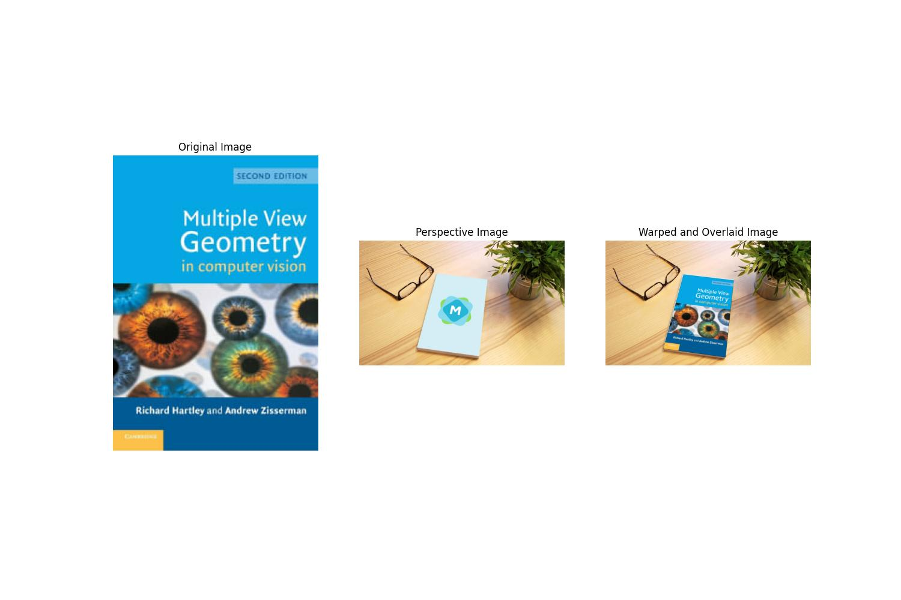</img>

## Painting

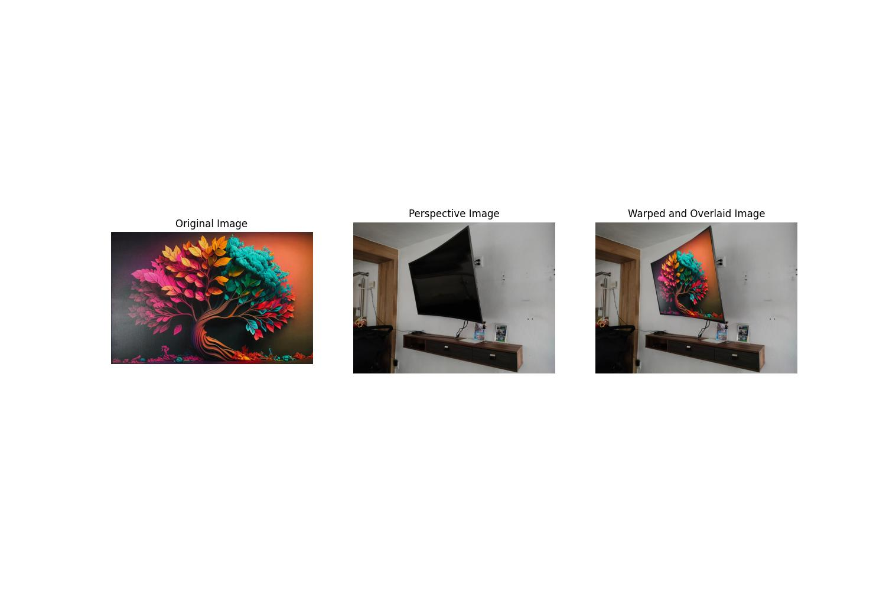</img>
